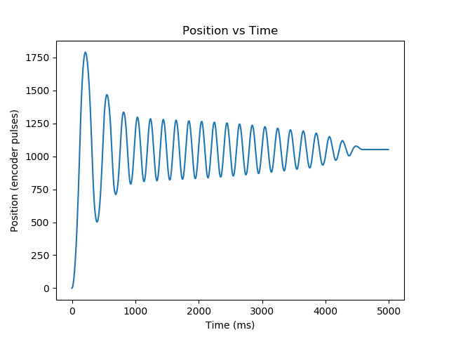
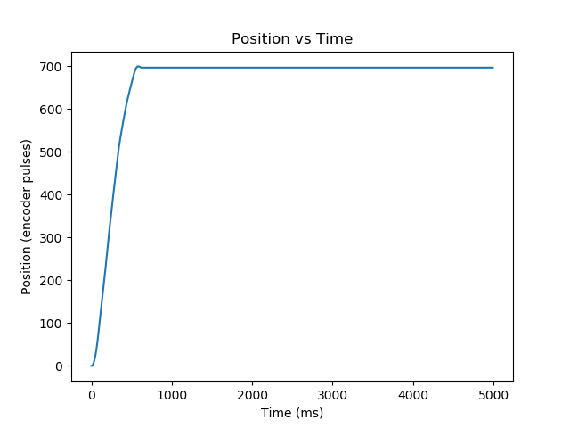
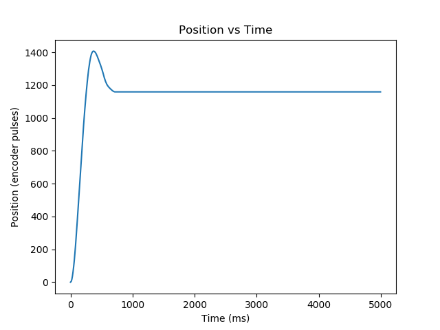

# Lab 2: Closed-Loop Controller
## ME 405 
#### **Authors: Tristan Cavarno, Miloh Padgett, Jon Abraham**

This lab involves implementing a closed-loop motor controller to set the position of a motor's output shaft. 
The performance of the controller is tested by observing the step response for a given positional setpoint
and is tuned by changing the motor gain.

#### Motor Controller
Positional (P) control is utilized to control the torque of the motor. The gain, *KP*, defines the ratio of 
the output torque to positional error (measured in encoder ticks).

#### Step Response Tests
Step response tests were performed for various values of *KP* to help determine an appropriate gain. The goal 
is to maximize the speed of the motor while minimizing overshoot, oscillation, and steady-state error. The results of this
testing can be seen below. 

